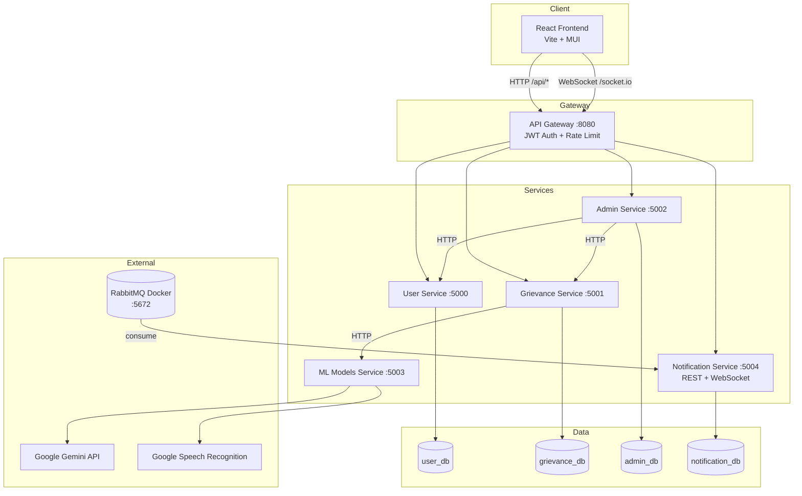
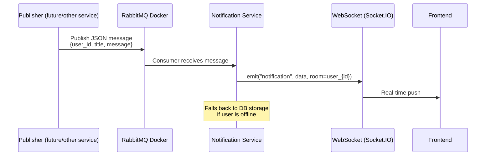

# AI-Based Grievance Management System

An end-to-end grievance management platform for educational institutions. Students can submit complaints via text or voice (with speech-to-text), and the system uses AI to classify grievances into the correct committee. Admins get dashboards, analytics, and real-time notifications.

The project follows a **microservices architecture** with a React frontend, Flask API gateway, separate backend services, an ML inference service, and RabbitMQ-backed real-time notifications.

---

## Table of Contents

- [Features](#features)
- [Architecture](#architecture)
- [Tech Stack](#tech-stack)
- [Project Structure](#project-structure)
- [Backend Services](#backend-services)
- [ML & AI Pipeline](#ml--ai-pipeline)
- [Notification System](#notification-system)
- [Database Design](#database-design)
- [API Reference](#api-reference)
- [Authentication](#authentication)
- [Prerequisites](#prerequisites)
- [Setup & Installation](#setup--installation)
- [Running the Project](#running-the-project)
- [Environment Variables](#environment-variables)
- [Frontend Routes](#frontend-routes)

---

## Features

### Student (User)
- Register and log in with JWT-based authentication
- Submit grievances with title, description, and optional voice recording
- **Speech-to-text** — record audio and auto-fill the description field
- **AI committee classification** — grievances are routed to the correct committee automatically when not manually assigned
- View personal grievance history and status
- Personal dashboard with stat cards and KPI reports (resolution rate, response time)
- Profile management

### Admin
- Separate admin login and role-based access
- View and manage all grievances across committees
- Dashboard with category-wise charts, stat cards, and line graphs
- Filter grievances by status and time range
- Batch user lookup for grievance details

### System
- **API Gateway** — single entry point with JWT validation and rate limiting
- **Real-time notifications** via WebSocket (Socket.IO) proxied through the gateway
- **Message queue** — RabbitMQ (Docker) for async notification delivery
- Multi-language support (English, Hindi, Marathi, Gujarati) for speech and classification

---

## Architecture



### Request Flow (Submit Grievance)

1. Student fills the form on the React frontend and optionally records voice.
2. Frontend sends `POST /api/grievances/add_grievance` to the **API Gateway** with a Bearer token.
3. Gateway validates JWT and proxies to the **Grievance Service**.
4. If no committee is manually selected, Grievance Service calls the **ML Service** for zero-shot classification.
5. Grievance is stored in MySQL with audio blob, committee ID, and metadata.
6. (Optional) A message can be published to **RabbitMQ** for the Notification Service to push a real-time update.

### Layer Pattern (Backend)

Each microservice follows a consistent structure:

```
service/
├── app.py              # Flask app entry point
├── routes/             # HTTP route definitions
├── controller/         # Request handling, auth checks
├── service/            # Business logic
├── view/               # Response formatting (JSON)
├── models/             # SQLAlchemy ORM models
├── clients/            # Inter-service HTTP clients (where applicable)
└── migrations/         # Alembic database migrations
```

Shared code lives in `backend/shared/` (JWT utilities, auth decorators, DB helpers, HTTP client base class).

---

## Tech Stack

| Layer | Technologies |
|-------|-------------|
| **Frontend** | React 19, Vite 6, React Router 7, Material UI 7, Tailwind CSS 4, Recharts |
| **Backend** | Python 3.12, Flask 3, Flask-SQLAlchemy, Flask-Migrate, Flask-CORS |
| **API Gateway** | Flask-Limiter, JWT (PyJWT), HTTP proxy |
| **ML / AI** | Transformers (BART MNLI), Google Speech Recognition, Google Gemini |
| **Messaging** | RabbitMQ (Docker), Pika |
| **Real-time** | Flask-SocketIO, Socket.IO |
| **Database** | MySQL (PyMySQL) |
| **Auth** | JWT (HS256), role-based decorators |

---

## Project Structure

```
AI-Based-Grivance-Management-System/
├── src/                          # React frontend
│   ├── page/                     # Route pages (login, dashboard, grievance, admin)
│   ├── components/               # Reusable UI components
│   ├── context/                  # React context (user session)
│   ├── css/                      # Stylesheets
│   └── utils/api.js              # API base URL and auth fetch helpers
├── backend/
│   ├── apprunner.py              # Starts all microservices
│   ├── api_gateway/              # Single entry point (:8080)
│   ├── user_app/                 # User registration & profile (:5000)
│   ├── grievance_app/            # Grievance CRUD & analytics (:5001)
│   ├── admin_app/                # Admin operations & dashboards (:5002)
│   ├── ML_Models/                # Speech-to-text & classification (:5003)
│   ├── notification_app/         # Notifications + WebSocket (:5004)
│   ├── config/                   # Centralized settings (.env loader)
│   ├── shared/                   # JWT, decorators, DB utils, HTTP client
│   ├── requirements.txt
│   └── .env.example
├── package.json
├── vite.config.js
└── README.md
```

---

## Backend Services

| Service | Port | Responsibility |
|---------|------|----------------|
| **API Gateway** | 8080 | Routes `/api/users/*`, `/api/grievances/*`, `/api/admin/*`, `/api/notifications/*`; proxies `/socket.io/*`; JWT validation; rate limiting |
| **User App** | 5000 | Student signup, login, profile update, batch user fetch |
| **Grievance App** | 5001 | Add/list grievances, speech-to-text proxy, audio retrieval, user/admin analytics |
| **Admin App** | 5002 | Admin signup/login, dashboard data, grievance category reports |
| **ML Models** | 5003 | Speech-to-text, zero-shot committee classification, Gemini translation |
| **Notification App** | 5004 | REST notification CRUD, WebSocket push, RabbitMQ consumer |

Inter-service communication uses HTTP via `BaseServiceClient` (`backend/shared/client/base_client.py`), forwarding the caller's `Authorization` header.

---

## ML & AI Pipeline

### 1. Speech-to-Text
- **Endpoint:** `POST /speech-to-text` (ML service, called internally by Grievance service)
- Converts recorded audio (WAV) to text using Google Speech Recognition
- Supports language codes: `en-IN`, `hi-IN`, `mr-IN`, `gu-IN`

### 2. Committee Classification
- **Endpoint:** `POST /committe-classification`
- Uses **Facebook BART-large-MNLI** zero-shot classification
- Candidate committees:
  - Examination
  - Infrastructure
  - General Facility
  - Research Facility
  - Journals/Literature
  - Fellowship
- Non-English text is first translated to English via **Google Gemini 1.5 Flash** before classification

### 3. Grievance Submission Logic
When a student submits a grievance:
1. If a committee is manually selected → use that committee
2. Otherwise → ML service classifies the description and assigns `c_id` automatically

---

## Notification System



- **RabbitMQ** runs in a Docker container (no local install required)
- Consumer connects using env vars (`RABBITMQ_HOST`, `RABBITMQ_PORT`, etc.)
- Auto-reconnect with exponential backoff if the container is not ready
- WebSocket connections join a room `user_{user_id}` after JWT validation
- Gateway proxies `/socket.io` traffic to the Notification Service

---

## Database Design

Each microservice can use its own MySQL database (configured via separate connection strings).

### User (`user_db`)
| Column | Type | Description |
|--------|------|-------------|
| u_id | INT PK | User ID |
| student_id | VARCHAR | Unique student ID |
| full_name, email, phone | VARCHAR | Profile fields |
| password | VARCHAR | Hashed password |
| department, year | VARCHAR | Academic info |

### Grievance (`grievance_db`)
| Column | Type | Description |
|--------|------|-------------|
| g_id | INT PK | Grievance ID |
| u_id | INT | Submitting user |
| c_id | INT FK | Committee ID |
| title, desc | VARCHAR/TEXT | Complaint content |
| audio | LONGBLOB | Voice recording |
| language | VARCHAR | Submission language |
| status | VARCHAR | e.g. Pending, Resolved |
| time_stamp, updated_at | DATETIME | Timestamps |

### Committee (`grievance_db`)
| c_id | c_name | address | email | phone |

Predefined committees: Examination (1), Infrastructure (2), General Facility (3), Research Facility (4), Journals/Literature (5), Fellowship (6).

### Admin (`admin_db`)
| admin_id | full_name | email | phone | password | c_id | created_at |

### Notification (`notification_db`)
| notification_id | user_id | title | message | created_at | is_read |

---

## API Reference

All external requests go through the gateway at `http://127.0.0.1:8080`.

### Public (no token)
| Method | Path | Description |
|--------|------|-------------|
| GET | `/api/health` | Gateway health check |
| POST | `/api/users/signup` | Student registration |
| POST | `/api/users/login` | Student login |
| POST | `/api/admin/signup` | Admin registration |
| POST | `/api/admin/login` | Admin login |

### Users (Bearer token)
| Method | Path | Description |
|--------|------|-------------|
| PUT | `/api/users/update` | Update profile |
| POST | `/api/users/users/batch` | Batch fetch users (admin) |

### Grievances (Bearer token)
| Method | Path | Description |
|--------|------|-------------|
| POST | `/api/grievances/add_grievance` | Submit grievance (multipart) |
| POST | `/api/grievances/speechToText` | Convert audio to text |
| GET | `/api/grievances/get_all_grievance/{user_id}` | User's grievances |
| GET | `/api/grievances/get_audio/{g_id}` | Download grievance audio |
| GET | `/api/grievances/get_data_statcard/{u_id}` | User stat card |
| GET | `/api/grievances/kpi_report/{u_id}` | User KPI report |
| GET | `/api/grievances/admin/all_grievance` | All grievances (admin) |
| GET | `/api/grievances/admin/grievanceCategory/{status}/{time_range}` | Category breakdown |
| GET | `/api/grievances/admin/get_data_statcard/{m}/{y}/{lm}/{ly}` | Admin stat card |
| GET | `/api/grievances/admin/get_line_graph_data/{time_range}` | Line graph data |

### Admin (Bearer token, admin role)
| Method | Path | Description |
|--------|------|-------------|
| PUT | `/api/admin/update` | Update admin profile |
| GET | `/api/admin/get_all_grievance` | All grievances |
| GET | `/api/admin/grievanceCategory/{status}/{time_range}` | Category report |
| GET | `/api/admin/get_data_statcard` | Dashboard stat card |
| GET | `/api/admin/get_line_graph_data/{time_range}` | Line graph |

### Notifications (Bearer token)
| Method | Path | Description |
|--------|------|-------------|
| GET | `/api/notifications/get_notifications/{user_id}` | List notifications |
| POST | `/api/notifications/mark_as_read/{notification_id}` | Mark as read |

### WebSocket
| Path | Description |
|------|-------------|
| `/socket.io/` | Real-time notifications (JWT via header or query `token`) |

---

## Authentication

- **JWT (HS256)** issued on login/signup with payload: `sub`, `role`, `isAdmin`, `iat`, `exp`
- Token stored in frontend `localStorage` via `UserContext`
- API Gateway validates token on all `/api/*` routes except public login/signup
- Downstream services re-validate using `@token_required`, `@user_required`, `@admin_required` decorators
- `JWT_SECRET` must be identical across all services (configured in `backend/.env`)

---

## Prerequisites

- **Python** 3.12+
- **Node.js** 18+ and npm
- **MySQL** 8+ (four databases or shared instance with separate schemas)
- **Docker** (for RabbitMQ message queue)
- **Google Gemini API key** (for non-English translation in ML pipeline)
- Microphone access in browser (for voice grievance feature)

---

## Setup & Installation

### 1. Clone the repository

```bash
git clone https://github.com/your-org/AI-Based-Grivance-Management-System.git
cd AI-Based-Grivance-Management-System
```

### 2. Start RabbitMQ (Docker)

```bash
docker run -d --name rabbitmq \
  -p 5672:5672 \
  -p 15672:15672 \
  rabbitmq:3-management
```

Management UI: http://localhost:15672 (default login: `guest` / `guest`)

### 3. Configure backend environment

```bash
cp backend/.env.example backend/.env
```

Edit `backend/.env` with your MySQL credentials, JWT secret, Gemini API key, and RabbitMQ settings (see [Environment Variables](#environment-variables)).

### 4. Create MySQL databases

Create four databases and users matching your connection strings:

```sql
CREATE DATABASE user_db;
CREATE DATABASE grievance_db;
CREATE DATABASE admin_db;
CREATE DATABASE notification_db;
```

### 5. Install backend dependencies

```bash
cd backend
pip install -r requirements.txt
```

### 6. Run database migrations

From each service directory (or with `FLASK_APP` set):

```bash
# User service
cd user_app && flask db upgrade

# Grievance service
cd ../grievance_app && flask db upgrade

# Admin service
cd ../admin_app && flask db upgrade

# Notification service
cd ../notification_app && flask db upgrade
```

### 7. Install frontend dependencies

```bash
cd ..   # back to project root
npm install
```

### 8. Configure frontend API URL (optional)

Create `.env` in the project root if the gateway is not on the default host:

```env
VITE_API_BASE_URL=http://127.0.0.1:8080
```

---

## Running the Project

### Start all backend services

```bash
cd backend
python apprunner.py
```

This launches:
- User App (5000)
- Grievance App (5001)
- Admin App (5002)
- ML Models (5003)
- Notification App (5004)
- API Gateway (8080)

Press `Ctrl+C` to stop.

### Start frontend dev server

In a separate terminal:

```bash
npm run dev
```

Open the URL shown by Vite (typically http://localhost:5173).

### Verify services

```bash
curl http://127.0.0.1:8080/api/health
# {"service":"api-gateway","status":"ok"}
```

---

## Environment Variables

All backend configuration is loaded from `backend/.env`.

| Variable | Default | Description |
|----------|---------|-------------|
| `CONNECTION_STRING` | — | Fallback database URL |
| `USER_CONNECTION_STRING` | — | User service DB |
| `GRIEVANCE_CONNECTION_STRING` | — | Grievance service DB |
| `ADMIN_CONNECTION_STRING` | — | Admin service DB |
| `NOTIFICATION_CONNECTION_STRING` | — | Notification service DB |
| `JWT_SECRET` | — | Shared JWT signing secret |
| `JWT_EXPIRY_HOURS` | 24 | Token lifetime |
| `USER_SERVICE_PORT` | 5000 | User service port |
| `GRIEVANCE_SERVICE_PORT` | 5001 | Grievance service port |
| `ADMIN_SERVICE_PORT` | 5002 | Admin service port |
| `ML_SERVICE_PORT` | 5003 | ML service port |
| `NOTIFICATION_SERVICE_PORT` | 5004 | Notification service port |
| `API_GATEWAY_PORT` | 8080 | Gateway port |
| `RABBITMQ_HOST` | localhost | Docker RabbitMQ host |
| `RABBITMQ_PORT` | 5672 | RabbitMQ AMQP port |
| `RABBITMQ_USER` | guest | RabbitMQ username |
| `RABBITMQ_PASSWORD` | guest | RabbitMQ password |
| `RABBITMQ_VHOST` | / | Virtual host |
| `RABBITMQ_URL` | — | Optional full AMQP URL (overrides above) |
| `NOTIFICATION_QUEUE` | notifications | Queue name |
| `GEMINI_API_KEY` | — | Google Gemini API key |
| `FLASK_DEBUG` | True | Flask debug mode |

---

## Frontend Routes

| Path | Role | Page |
|------|------|------|
| `/login` | All | Login |
| `/signup` | All | Registration |
| `/` | User / Admin | Home / Complaint list |
| `/addGrievance` | User | Submit new grievance |
| `/dashboard` | User / Admin | Analytics dashboard |
| `/profile` | User / Admin | Profile settings |
| `/settings` | User | App settings |

Role-based rendering is handled in `App.jsx` using `User.isAdmin` from context.

---

## Development Notes

- **First ML request** may be slow while Hugging Face downloads the BART model (~1.6 GB).
- **RabbitMQ consumer** retries automatically if the Docker container is not running at startup.
- **Audio format:** frontend converts WebM recordings to WAV before sending to speech-to-text.
- **Rate limits:** gateway applies 200 req/min globally and 100 req/min per service proxy.
- **CORS:** enabled on gateway (`/api/*`) and individual services for local development.

---

## License

This project is part of a software engineering coursework / institutional grievance system. Update licensing as appropriate for your organization.
